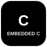
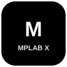
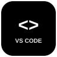

# Hi, I'm Shrey Kohli 👋

### Electronics Engineering Graduate | Aspiring VLSI, Verification & Embedded Engineer

Building hands-on skills in **RTL Design, Verilog, SystemVerilog, UVM, FPGA & Embedded Systems**.

Interested in **VLSI • Design Verification • RTL/FPGA • Embedded Systems**.

---

## 🛠️ Tech Stack

### 💻 VLSI / RTL / Verification

**RTL Design** • **Digital Logic** • **Computer Architecture** • **RISC-V** • **Functional Verification**

### ⚙️ Embedded Systems

**Embedded C** • **Microcontrollers** • **GPIO** • **Timers & Interrupts** • **UART** • **SPI** • **I2C** • **CAN**

### 🔬 Simulation & Engineering

### 🧑‍💻 Development

---

## 📚 Currently Learning

**Advanced SystemVerilog → UVM → Assertions → RTL Verification → Embedded C**

---

## 🎯 Open to Opportunities

**VLSI / RTL Design • Design Verification • FPGA • Embedded Systems • Embedded Firmware**

---

## 📫 Connect

---

### ⚡ Hardware • Logic • Code • Systems
